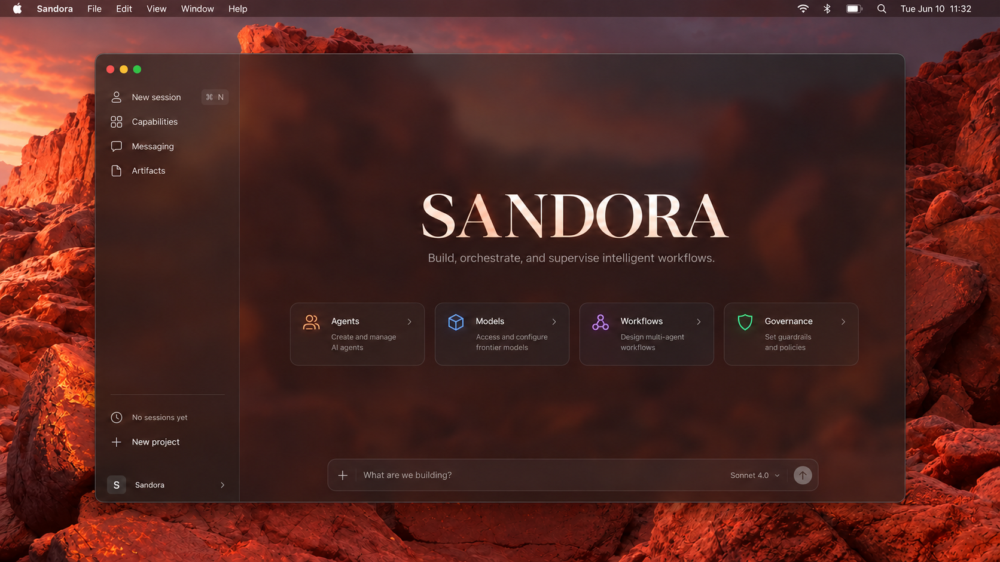
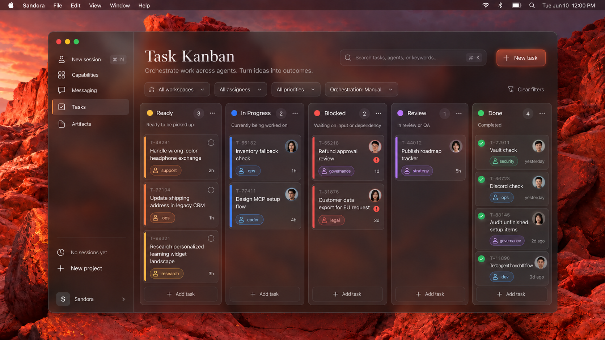
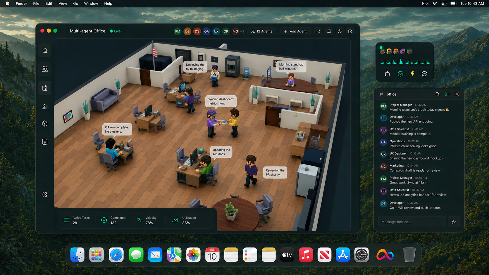
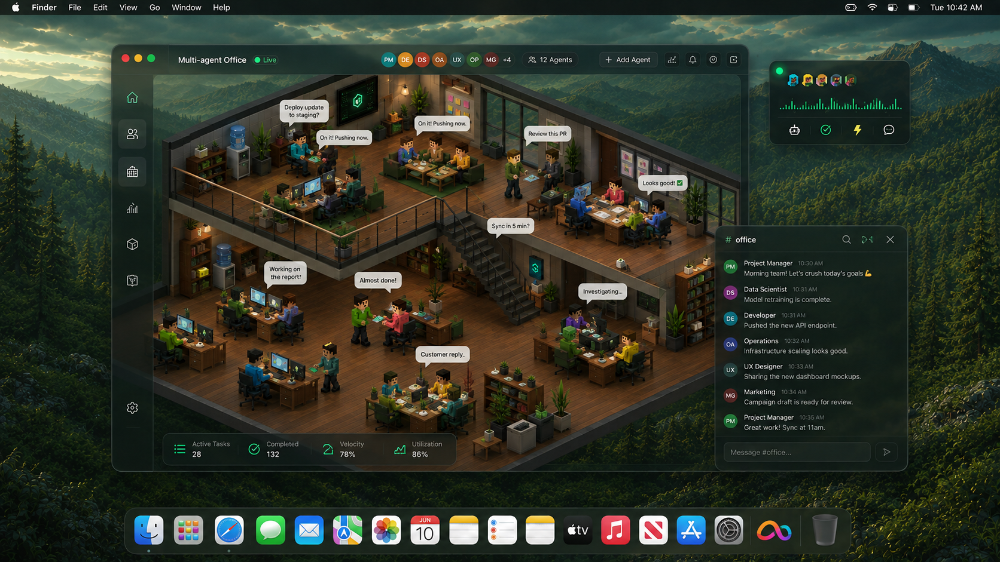
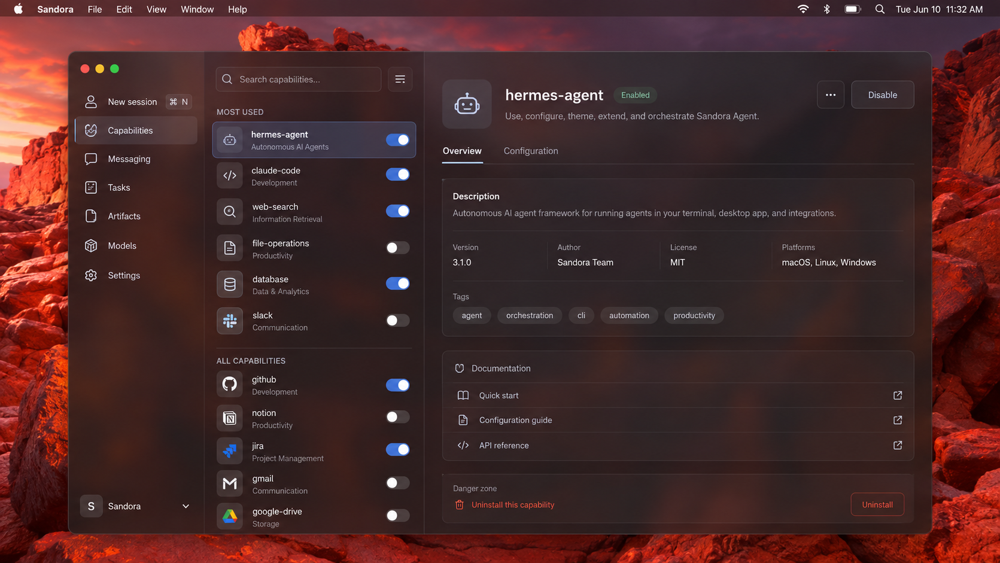
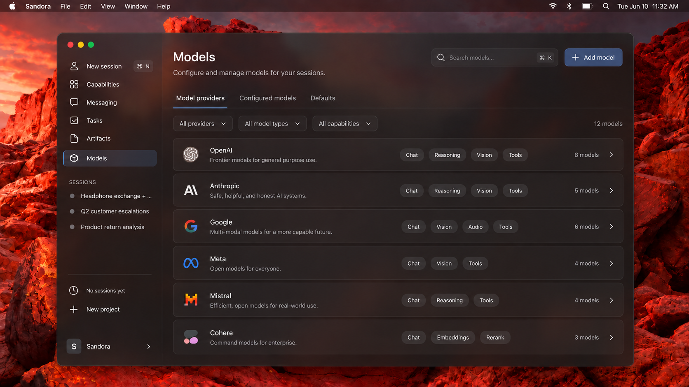
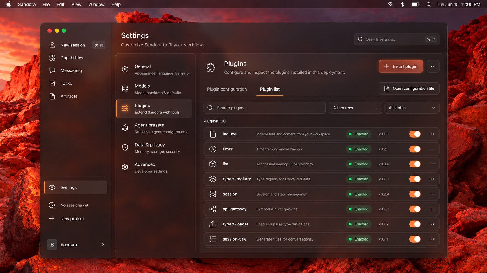
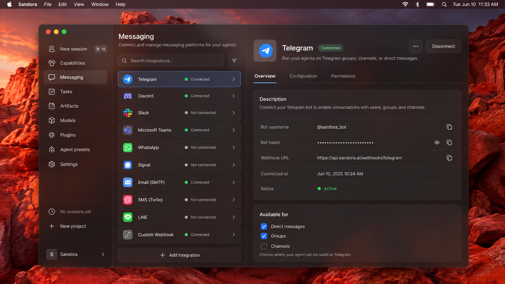
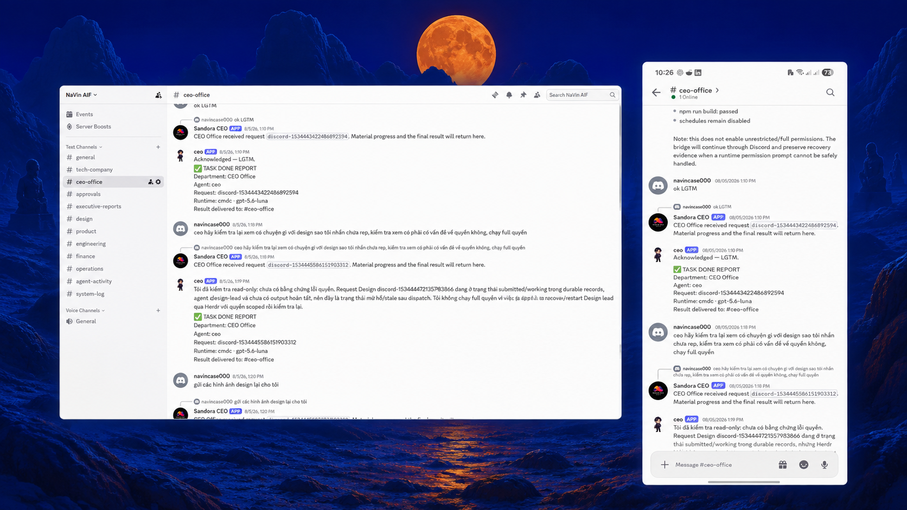
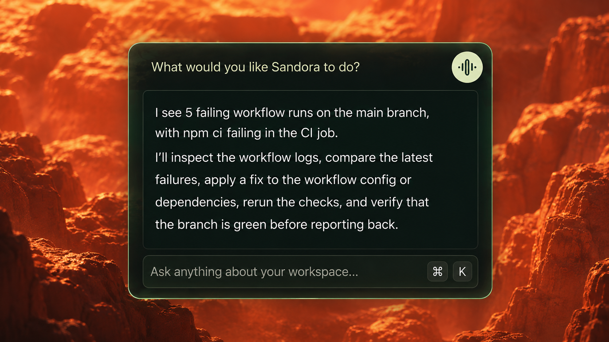

# Sandora

<p align="center">
  
</p>

<p align="center">
  <strong>AI should not stop at answering. It should finish the job.</strong>
</p>

<p align="center">
  <a href="https://github.com/kyoo-147/Sandora/stargazers"></a>
  <a href="https://github.com/kyoo-147/Sandora/issues"></a>
  <a href="https://github.com/kyoo-147/Sandora/blob/main/LICENSE"></a>
</p>

Sandora is an **AI Department OS** and governed adaptive agent runtime for completing real business work—not just generating answers.

Instead of treating AI as a single chatbot, Sandora brings together agents, tools, memory, workflows, permissions, approvals, observability, model routing, computer use, and learning in one operating layer.

> [!IMPORTANT]
> **Sandora is under active development.** This public repository is currently a product and technical reference while the latest implementation is being distilled into a smaller, public-ready open-source release. APIs, interfaces, architecture, and product scope may change.

## Public source note

We cannot publish the latest source code at this time because of versioning, commercial, and privacy constraints. The active implementation includes product, workflow, and business-specific details that are still being distilled into a smaller public-ready version.

Private business logic, customer-specific workflows, proprietary integrations, credentials, private datasets, and unreleased commercial components will remain excluded. We will publish reusable primitives as they are ready for safe release.

## The execution loop

```text
User intent
  → understand context
  → plan
  → select capabilities
  → check policy and permissions
  → execute
  → observe
  → verify
  → retry, re-plan, or escalate when needed
  → complete the task
  → store the execution trajectory
```

The model is one component. Sandora focuses on the operating layer around it.

## Product surfaces

| Surface | Purpose |
| --- | --- |
| **Agent Directory** | Create and manage specialized agents for support, operations, research, development, data, review, and more. |
| **Agent Configuration** | Define role, model, tools, skills, memory scope, permissions, approval rules, knowledge, and execution policy. |
| **Mission Control** | Monitor active work, delegated runs, approvals, retries, failures, model usage, and outcomes. |
| **Company Chat** | Turn internal conversations into executable tasks and coordinate people with agents. |
| **HUD** | Provide lightweight contextual assistance over the user’s current application and screen context. |
| **Computer Use** | Let agents work with browsers, desktop applications, legacy software, and systems without APIs. |
| **Agent Office** | Visualize live agent states such as working, using tools, awaiting approval, reviewing, blocked, and completed. |

## Screenshots

### Start with intent

<p align="center"></p>

### Orchestrate work

<p align="center"></p>

### See the department at work

<p align="center"></p>

<p align="center"></p>

### Configure the system

<p align="center">
  
  
</p>

<p align="center">
  
  
</p>

### Work across contexts

<p align="center"></p>

<p align="center"></p>

## Core runtime

Sandora Core Runtime manages the complete lifecycle of an agent task:

- Agent profiles, sessions, context, memory, and skills
- Model selection and capability routing
- Tool execution, policy checks, and approvals
- Retries, delegation, verification, and failure recovery
- Final-state validation and structured execution traces

A typical governed action is:

```text
Action → permission check → policy check → risk classification
       → approval when required → execution → verification → audit log
```

People can observe, approve, reject, interrupt, steer, correct, or take over a task.

## Architecture

Sandora is organized around logical layers rather than a single monolithic agent:

```text
Interaction
  Desktop · Chat · HUD · Communication channels · Agent Office

Organizational intelligence
  Roles · Departments · Assignment · Delegation · Coordination

Agent harness
  Agent loop · Context · Sessions · Reasoning · Tool execution

Capability registry
  Native tools · MCP servers · Computer Use · Workflows · Integrations

Memory and skills
  Persistent knowledge · Episodic memory · Experience · Procedures

Governance and observability
  Permissions · Policy · Approval · Audit · Recovery · Traces

Foundation models
  Cloud models · Local models · VLMs · Model routing
```

## Everything is a plugin

Capabilities are replaceable and permission-scoped:

- Models and model providers
- Native tools and MCP servers
- Memory providers and skills
- Communication channels and workflows
- Computer Use and UI extensions
- Evaluators and learning components

The Capability Registry selects only what is relevant to the task, state, permission scope, and risk level instead of exposing every available tool to the model.

## Memory, knowledge, and policy

Sandora separates memory into scopes such as customer, organization, episodic, and experience memory. Memory is permission-scoped and should preserve provenance rather than blindly storing every model or user statement.

Knowledge contains products, documentation, FAQs, and operational facts. **Policy defines what an agent is allowed or required to do.** When knowledge conflicts with authoritative policy, policy takes priority. If the correct rule cannot be determined safely, Sandora should escalate instead of guess.

## Adaptive learning

Sandora’s learning loop is deliberately governed:

```text
Execution → trajectory → outcome and correction → curation
  → privacy filtering → quality gate → dataset → adapter training
  → evaluation → regression test → promote or rollback
```

Adaptation may happen through configuration, persistent memory, procedural skills, retrieved demonstrations, or post-training such as LoRA/QLoRA. No experience is automatically promoted into long-term behavior without quality, privacy, policy, generalization, and regression checks.

## Evaluation

Sandora evaluates agents on final outcomes, not only conversation quality. Sandora-CS-Eval is designed around controlled business scenarios with customers, orders, inventory, shipping, returns, refunds, policies, tools, hidden constraints, and approval conditions.

Key dimensions include task success, policy compliance, final-state correctness, correction rate, false resolution, tool errors, latency, token usage, cost, and human takeover.

## Roadmap to the public release

The public version is expected to focus on reusable components such as:

- Agent runtime primitives
- Capability Registry and MCP integration
- Governance and approval controls
- Execution traces
- Memory interfaces and skills
- Evaluation tooling
- Example workflows
- Desktop interaction components

Sandora is currently focused on customer support and operational workflows, with a longer-term direction spanning engineering, research, marketing, finance, administration, and internal automation.

## Contributing

Contributions, issue reports, design feedback, and thoughtful discussion are welcome. Because the public architecture is still being distilled, please open an issue before beginning a large implementation so we can align on scope and public-release boundaries.

## License

License information will be updated when the public source package is ready.

---

**Sandora** — *AI should not stop at answering. It should finish the job.*
