# Sandora

> **Public source note**  
> We cannot publish the latest source code at this time because of versioning, commercial, and privacy constraints. The active implementation includes product, workflow, and business-specific details that are still being distilled into a smaller public-ready version.

Sandora is an **AI Department OS** for building virtual AI teams, automated workflows, and human-governed business operations.

Instead of treating AI as a single chatbot, Sandora models a small operating company: departments, agents, tools, memory, workflows, approvals, audit logs, and measurable outcomes.

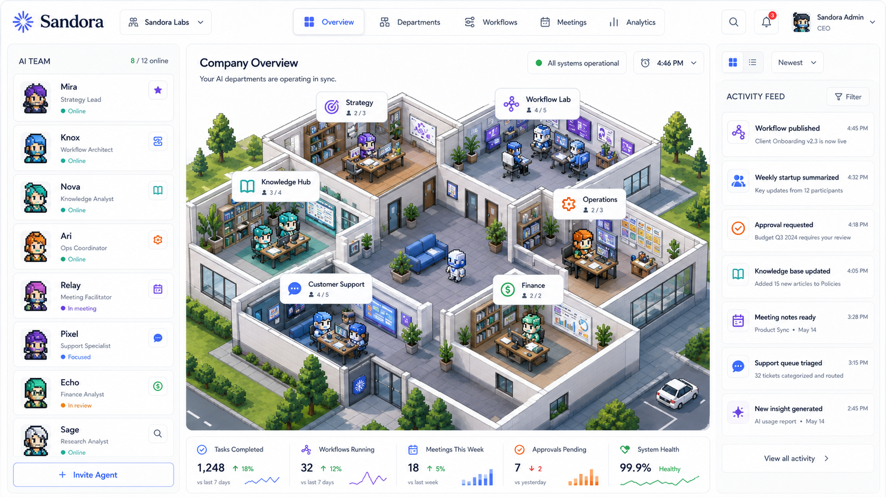

## Why Sandora Exists

Small teams often lose time to repeated operational work:

- Customer support triage, summaries, follow-ups, and reporting.
- Internal research, planning, meeting notes, and task routing.
- Marketing, sales, operations, finance, and admin workflows that span multiple tools.
- Business actions that need approval before they are executed.

Many AI products can answer prompts. Fewer systems can coordinate work across roles, permissions, data, tools, and approval gates. Sandora focuses on that operating layer.

## From DropPilot To Sandora

Sandora was previously called **DropPilot** and was originally focused on the dropshipping market.

The first product wedge was useful: AI agents for product research, supplier operations, creative work, ads, orders, and support. But the deeper insight was that the valuable part was not dropshipping itself. The valuable part was the platform structure:

- Create a company workspace.
- Define departments.
- Add specialized agents.
- Give each agent tools, memory, permissions, and model policies.
- Run workflows with approval checkpoints.
- Track cost, quality, latency, and business impact.

That is why the product expanded from DropPilot into Sandora: a broader AI Department OS for startups, agencies, small businesses, and internal teams.

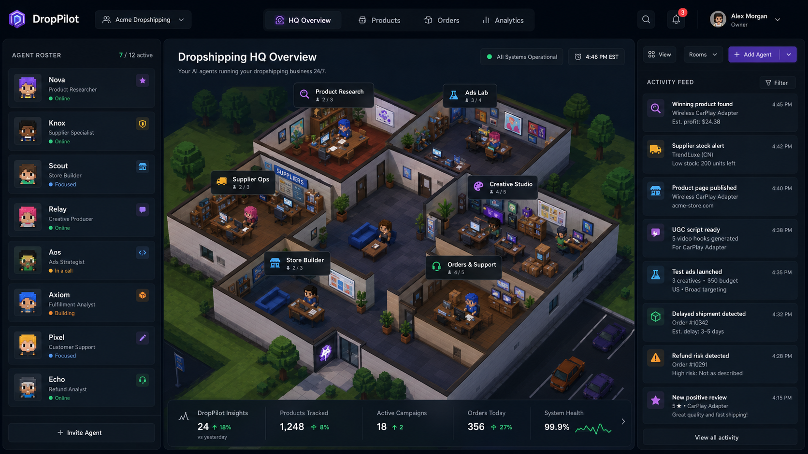

## Product Surface

### Agent Directory

The agent directory helps users discover and add AI agents by department, skill, model, status, and connected tools.

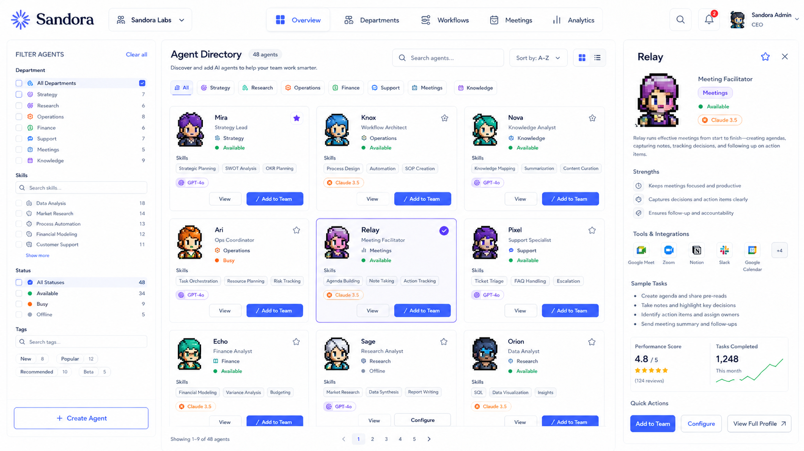

### Configure Agent

Each agent is configured as a controlled operating unit:

```txt
Agent = Role + Department + Model + Tools + Memory Scope + Permissions + Approval Rules + Output Contract
```

The configuration screen covers persona, model fallback, knowledge sources, tool access, permissions, approvals, and test prompts.

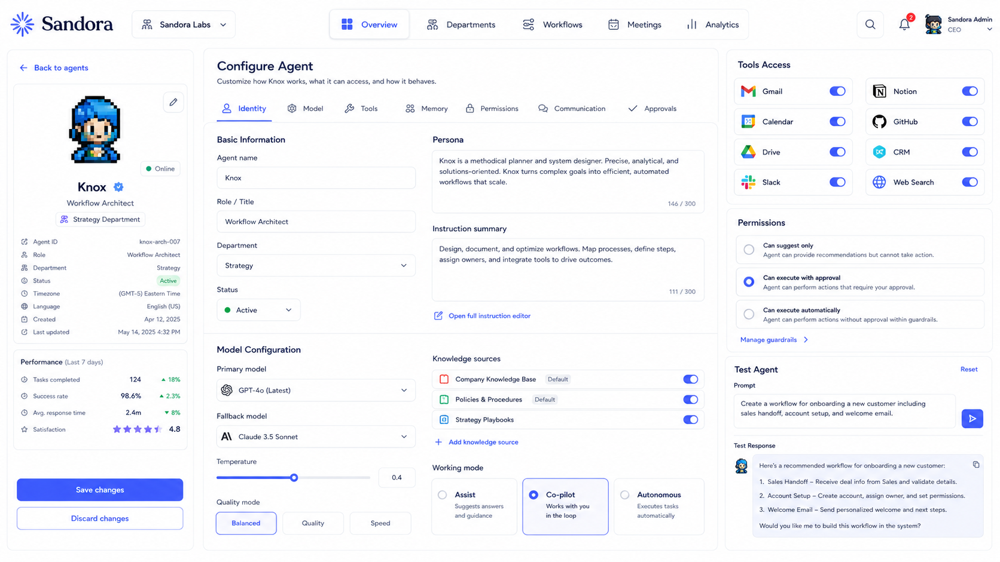

### Mission Control

Mission Control is the execution surface for work: backlog, in-progress tasks, review queues, assignments, automation flow, approval checkpoints, and impact estimates.

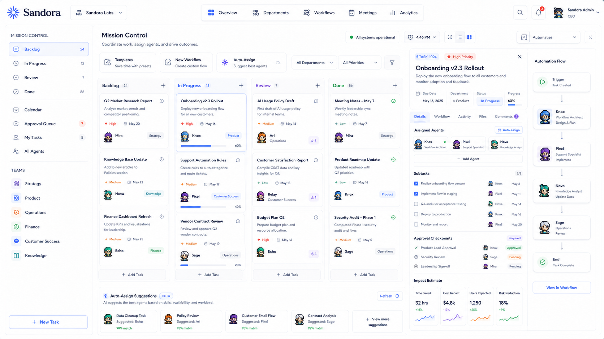

### Company Chat

Company Chat connects channels, pinned summaries, linked tasks, files, meetings, shared decisions, and agent participation into a company-level communication layer.

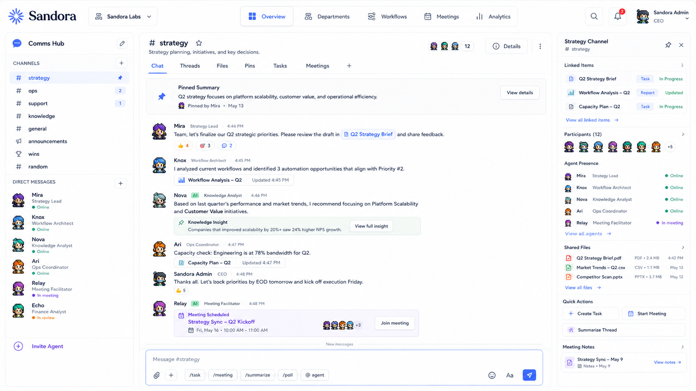

## System Architecture

Sandora is designed around this high-level architecture:

```txt
User Workspace
  -> Department Builder
  -> Agent Runtime
  -> Workflow Engine
  -> Integration Hub
  -> Approval Center
  -> Analytics / Audit
```

Core backend direction:

- **Next.js** for product UI and server routes.
- **Node.js** for orchestration and integration workers.
- **PostgreSQL** for durable workspace, workflow, run, audit, and billing data.
- **Redis** for queues, run state, caching, locks, rate limits, and short-lived coordination.

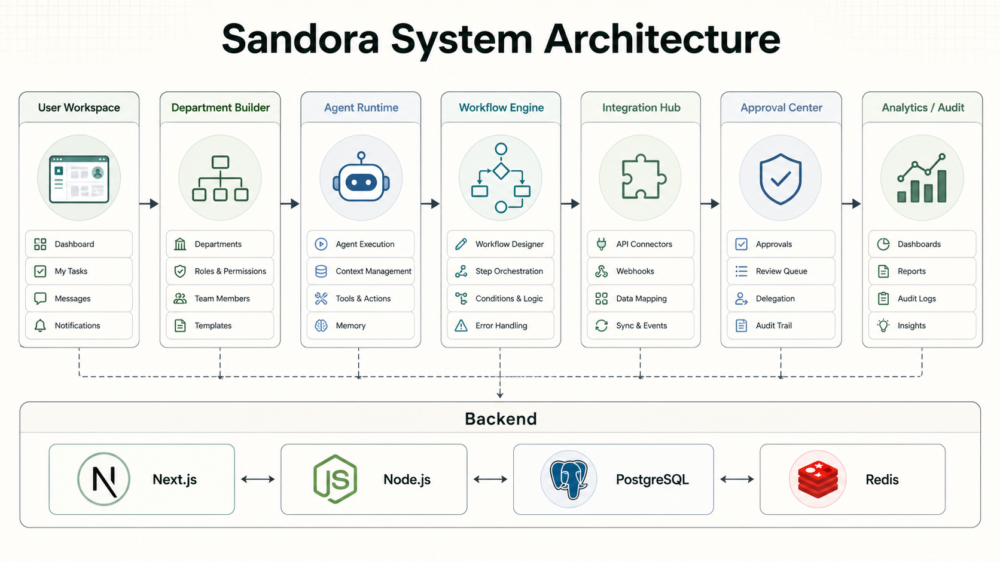

## Custom Workflow Engine

Sandora uses a custom workflow engine based on graph/state-machine concepts.

```txt
Trigger
  -> State Graph
  -> Agent Task
  -> Tool Action
  -> Condition
  -> Handoff
  -> Approval Gate
  -> Execute
  -> Log
```

Important engine capabilities:

- Run history for every workflow execution.
- Retry policy for unstable model or tool calls.
- Fallback behavior across models, tools, or human review.
- Conditional branches based on task output, risk level, cost, or business state.
- Approval gates before risky actions such as sending email, publishing content, writing data, launching campaigns, or spending budget.

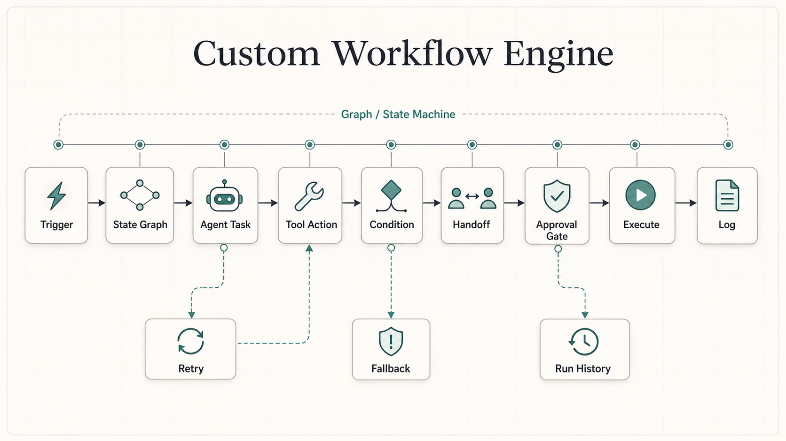

## Agent Runtime And Permission Model

Sandora treats each agent as a governed runtime, not just a prompt template.

The runtime needs to answer:

- What is this agent allowed to know?
- What tools can it use?
- Which actions can it execute automatically?
- Which actions require approval?
- Which model should it use for this task?
- How do we validate the output?
- How do we log the action for review?

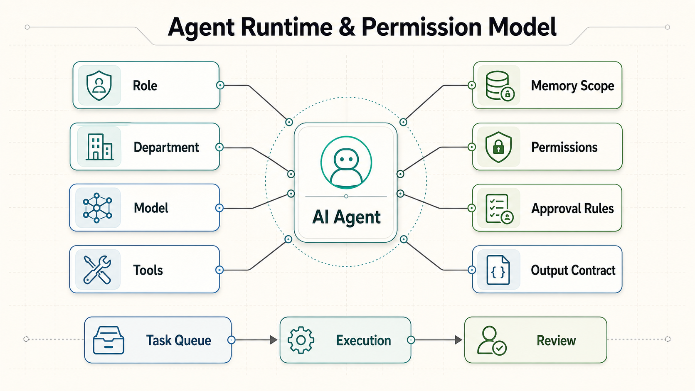

## Model Routing And Cost Optimization

Sandora is model-provider flexible. A workspace may use OpenAI, Gemini, Claude, local models, or a managed plan.

The routing layer is designed around:

```txt
Task classification
  -> Model router
  -> Provider / local model / custom plan
  -> Cost tracking
  -> Latency and quality metrics
  -> Fallback
```

The key product belief is simple: the strongest model is not always the best model. For many business workflows, cost, latency, control, reliability, and approval behavior matter as much as raw model quality.

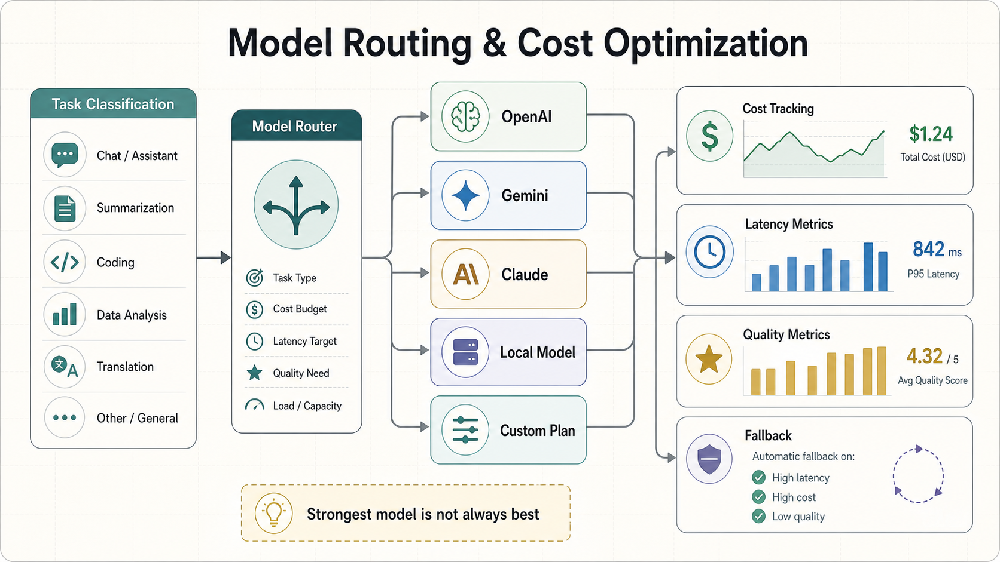

## Company Brain / Memory Layer

Sandora needs a scoped memory layer for company context:

- Documents.
- SOPs.
- Chats.
- Meeting notes.
- Client files.
- Policies.
- Research.
- Prior task history.

This layer is indexed for retrieval and restricted by company, department, agent, and permission scope. A finance agent should not automatically see private HR files. A support agent should not write to a CRM without the right policy and approval path.

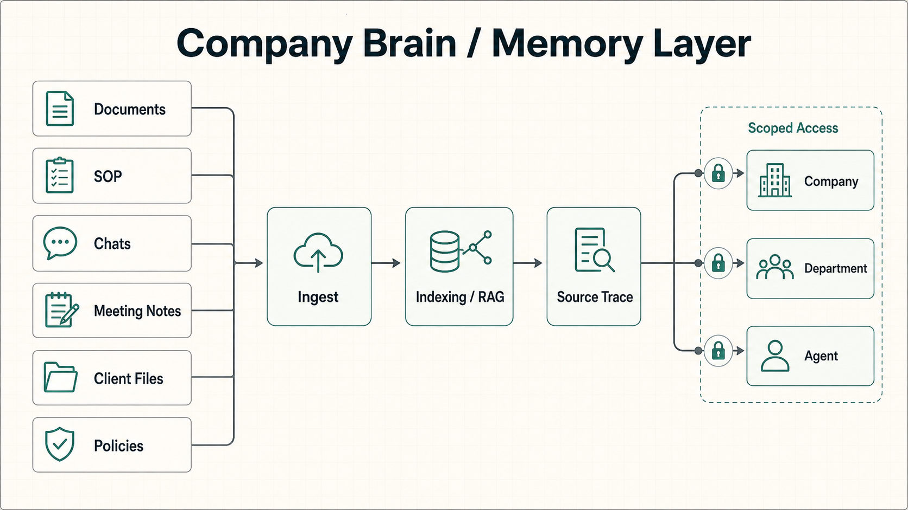

## Integration And Automation Layer

Sandora is designed to connect with external tools through permissioned actions:

- Gmail.
- Slack.
- Drive.
- Notion.
- CRM systems.
- GitHub.
- Calendar.
- Webhooks and custom APIs.

The integration layer must support credential handling, rate limits, validation, dry-runs, approval checks, execution logs, and rollback where possible.

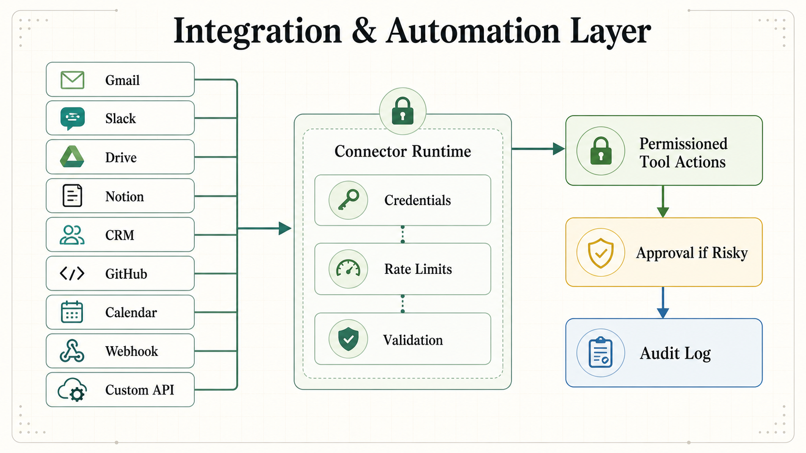

## Industry Template Expansion

DropPilot was the first template. Sandora expands the same operating model into multiple departments and industries:

- Marketing agency.
- Recruitment.
- Customer support.
- Finance and admin.
- Software and product teams.
- Internal operations.
- Ecommerce and dropshipping.

The goal is not to hard-code one vertical. The goal is to make it easier to compose an AI department around a specific business process.

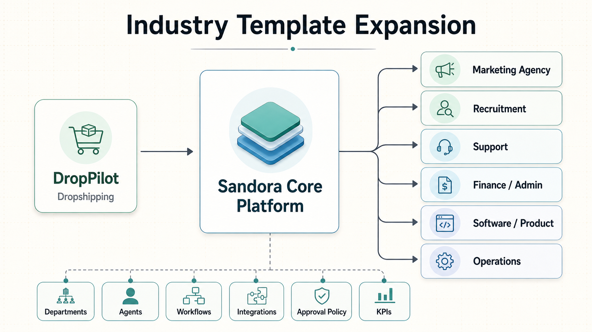

## Impact Direction

Sandora is being shaped around practical business impact:

- Reduce time spent on repeated operational tasks.
- Improve handoff quality between roles and departments.
- Keep risky AI actions under human approval.
- Make AI usage measurable through cost, latency, quality, and audit history.
- Help small teams operate with more structure without hiring a full department.

The current product direction has also been tested conceptually against small controlled business operations where repeated tasks can be delegated, reviewed, and measured.

## Current Status

Sandora is still under active development. This public repository is currently used as a public-facing product and technical brief while the latest source is prepared for a safer, smaller, public version.

Near-term work:

- Distill the private implementation into a clean public codebase.
- Keep architecture, product documentation, and screenshots updated.
- Separate generic platform primitives from business-specific/private workflows.
- Publish a minimal runnable version once the source is safe to open.

## License

License information will be updated when the public source package is ready.
